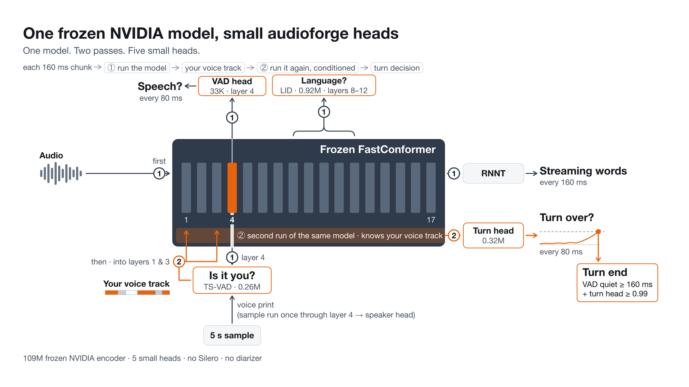
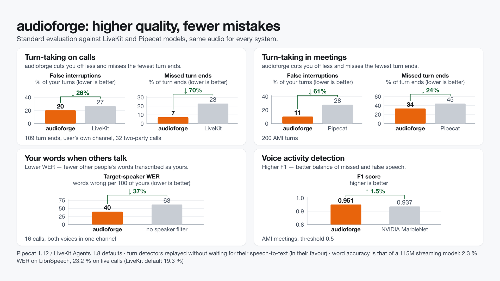

# audioforge

One frozen NVIDIA streaming speech model with five small heads: live words, voice activity, "is it the user?" and
"is the turn over?" for a voice agent that talks to one known user, over one WebSocket.



A 115M NVIDIA cache-aware FastConformer ([`stt_en_fastconformer_hybrid_large_streaming_multi`](docs/MODELS.md),
frozen, 160 ms chunks) gives the words (RNNT). The heads read its layers ([`docs/ARCHITECTURE.md`](docs/ARCHITECTURE.md)):

| head | reads | size | job |
|---|---|---|---|
| VAD | layer 4 | 33K | is anyone speaking? |
| speaker | layer 4 | 0.5M | a 192-number voice print |
| TS-VAD | layer 4 + the stored print | 0.26M | is it the user or someone else? |
| turn | a second, speaker-conditioned pass (GRU) | 0.32M | is the user's turn over? |
| LID (optional) | layers 8-12 | 0.92M | which language? |

## What you get

- **Live transcripts** as the user talks (`partial`), and one `final` per turn.
- **Voice activity** every 80 ms from the model's own VAD head. No Silero.
- **Target speaker:** each frame and turn says whether the user or someone else is talking, from the user's stored
  voice print. No diarizer is loaded.
- **Turn ends** (`turn_end`) from the `vad_head` rule: the VAD and turn heads together.
- **One model, plain PyTorch** (no NeMo), on CPU, Mac GPU (`--device mps`) or CUDA. Pipecat and LiveKit adapters.

## Quickstart

Python 3.10+. `audioforge-download` shows each weight's licence and asks before fetching.

```bash
git clone https://github.com/maxmelichov/audioforge && cd audioforge
pip install -e ".[serve]"
audioforge-download          # the 115M model + heads, sha256-checked, into ./models
audioforge-serve             # single mode, ws://127.0.0.1:8765  (--device mps|cuda for a GPU)
```

In a second terminal, stream the bundled 16 s two-party call ([`examples/audio/two_party_call_16s.wav`](examples/audio),
otoSpeech, CC BY 4.0) with the user's stored print (`two_party_call_16s.voiceprint.json`):

```bash
python examples/quickstart_client.py        # or: ... my.wav --voiceprint me.json
```

Output on an Apple M5 laptop (CPU, 2 threads; intermediate partials omitted):

```
  0.00s  voiceprint source=explicit seconds=0.0
  8.16s  partial   so um what value guides your life
 11.36s  partial   so um what value guides your life what values do you live by
 11.78s  turn_end  policy=vad_head silence_ms=640
 11.78s  final     speaker=0 'so um what value guides your life what values do you live by'
 15.20s  partial   value guys my life
 15.30s  turn_end  policy=vad_head silence_ms=160
 15.30s  final     speaker=1 'value guys my life'
```

The user's question is one turn despite a half-second pause after "life"; the other party's answer comes out as
`speaker=1`. In Python, without a socket ([`examples/python_api.py`](examples/python_api.py)):

```python
import audioforge
fe = audioforge.load()                      # device="mps" / "cuda" also work
s = fe.session(sample_rate=16000)
s.enroll(voiceprint)                        # 192 numbers, or fe.voiceprint(>= 5 s of the user's clean speech)
events = s.feed(pcm) + s.end()              # the protocol's messages as dicts
```

## Results

Same audio for every system in a row. LiveKit = LiveKit Agents defaults (Silero + LiveKit turn detector + Whisper
small); Pipecat = Pipecat defaults (Silero + smart-turn v3 + Whisper small). What each metric means:
[`research/METRICS.md`](research/METRICS.md).

| metric | audioforge | LiveKit | Pipecat | source |
|---|---|---|---|---|
| **Calls** (32 sessions, user channel, 109 turn ends) | | | | |
| end-of-turn latency, p50 | 956 ms | 567 ms | 237 ms (bimodal: 38 of 82 answered ends wait for the 3 s fallback; p95 3217 ms) | [EOT_LATENCY](research/EOT_LATENCY.md) |
| false interruptions (% of turns) | 20 % | 27 % | 36 % | [EOT_LATENCY](research/EOT_LATENCY.md) |
| missed turn ends | 7 % | 23 % | 25 % | [EOT_LATENCY](research/EOT_LATENCY.md) |
| **Meetings** (AMI, 200 turns) | | | | |
| end-of-turn latency, p50 | 1326 ms | 1890 ms | 384 ms | [EOT_LATENCY](research/EOT_LATENCY.md) |
| false interruptions | 11 % | 13 % | 28 % | [EOT_LATENCY](research/EOT_LATENCY.md) |
| missed turn ends | 34 % | 68 % | 45 % | [EOT_LATENCY](research/EOT_LATENCY.md) |
| **Words** | | | | |
| WER, LibriSpeech test-clean (200 utt.) | 2.3 % | 2.4 % (Whisper small) | 2.4 % | [FINAL_REPORT](research/FINAL_REPORT.md), [MPS_115M](research/MPS_115M.md) |
| WER, live calls | 23.2 % | 19.3 % | 23.5 % | [METRICS](research/METRICS.md) |
| target-speaker WER, mixed calls | 40 % (no filter 63, perfect labels 36) | – | – | [TSWER](research/TSWER.md) |
| target-speaker WER, ICSI meetings | 37 % (Nemotron-3 diarizer 65-67, no filter 101) | – | – | [TSWER](research/TSWER.md) |
| **VAD** F1, AMI (threshold 0.5) | 0.951 | 0.915 (Silero) | 0.915 (Silero) | [METRICS](research/METRICS.md) (MarbleNet 0.937) |
| **Cost** per 160 ms chunk, whole engine | 29.8 ms CPU (2 threads); 28.7 ms Mac GPU; 20 ms RTX 5090 | | | [MPS_115M](research/MPS_115M.md), [PR #1](https://github.com/maxmelichov/audioforge/pull/1) |

Real-time streams per Mac process: 4 on CPU, 5 on MPS; CPU and MPS give identical events
([MPS_115M](research/MPS_115M.md)). The VAD head was trained on AMI labels, so its AMI F1 is in-domain.



## Where it loses

- **Words are those of a 115M streaming model.** On live calls LiveKit's default (Whisper small) transcribes better,
  23.2 vs 19.3 % WER. For a meeting-grade transcript use room mode with Parakeet-TDT v3.
- **Not the fastest turn end.** LiveKit answers calls sooner (567 vs 956 ms p50) and Pipecat answers meetings sooner
  (384 vs 1326 ms), at more false interruptions. In meetings audioforge still misses 34 % of turn ends.

## Modes and the voice sample

**Single mode** (`audioforge-serve`, the default) is the product: one model, no Silero, no diarizer. It needs the
user's voice print, taken from **at least 5 s of their clean speech, alone (10 s for meetings)**. Store it per user
and send it right after the session config:

```json
{"type": "enroll", "embedding": [0.0213, -0.0871, "... 192 numbers"]}
```

Make one with `audioforge.voiceprint(audio)`, or start the server with `--enroll explicit` and send `{"type":
"enroll"}` to take the next 5 s of speech. Without a stored print the server grabs one live after `agent_end`,
which tracks the user worse ([`research/SINGLE_MODEL.md`](research/SINGLE_MODEL.md)).

**Room mode** (`audioforge-download --diarizer nemotron3`, then `audioforge-serve --mode room`) is opt-in: NVIDIA
Nemotron-3-Diarization labels everyone in the room, and `--final-asr tdt_v3` rewrites each turn with Parakeet-TDT v3.

## Integrations

- **Pipecat:** `pip install -e ".[pipecat]"`, `audioforge.integrations.pipecat` (VAD, STT and turn analyzer);
  demo [`examples/pipecat_local_demo.py`](examples/pipecat_local_demo.py).
- **LiveKit Agents:** `pip install -e ".[livekit]"`, `audioforge.integrations.livekit.AudioforgeFrontend`; worker
  [`examples/livekit_agent_worker.py`](examples/livekit_agent_worker.py).
- **Any language:** the WebSocket protocol ([`docs/PROTOCOL.md`](docs/PROTOCOL.md)); a torch-free Python client is in
  [`packages/audioforge-client`](packages/audioforge-client).

## Docs

| | |
|---|---|
| [`docs/ARCHITECTURE.md`](docs/ARCHITECTURE.md) | the model and the server on one page |
| [`docs/CONFIGURATION.md`](docs/CONFIGURATION.md) | every flag and what it costs |
| [`docs/PROTOCOL.md`](docs/PROTOCOL.md) | the WebSocket messages |
| [`docs/MODELS.md`](docs/MODELS.md) | the downloaded weights, pinned revisions, licences |
| [`docs/SERVER_INTERNALS.md`](docs/SERVER_INTERNALS.md) | frame clock, policies, enrollment |
| [`research/METRICS.md`](research/METRICS.md) | metric definitions and the full scorecard |
| [`research/README.md`](research/README.md) | index of every lab note, with its key number |
| [`CHANGELOG.md`](CHANGELOG.md) | what changed |

## Licence

- Code and the trained heads: Apache-2.0 ([`LICENSE`](LICENSE)).
- The NVIDIA encoder: CC-BY-4.0; `audioforge-download` fetches it from NVIDIA and the merged model keeps that licence
  (attribution to NVIDIA).
- The LID head was trained on NVIDIA AmberNet outputs (NGC Terms of Use). Treat it as under those terms until its
  redistribution is confirmed; it is optional.
- Silero VAD is no longer needed in single mode. Room-mode weights keep their own licences. Full list:
  [`NOTICE`](NOTICE), [`docs/MODELS.md`](docs/MODELS.md).
