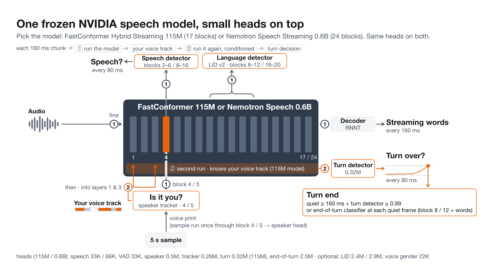
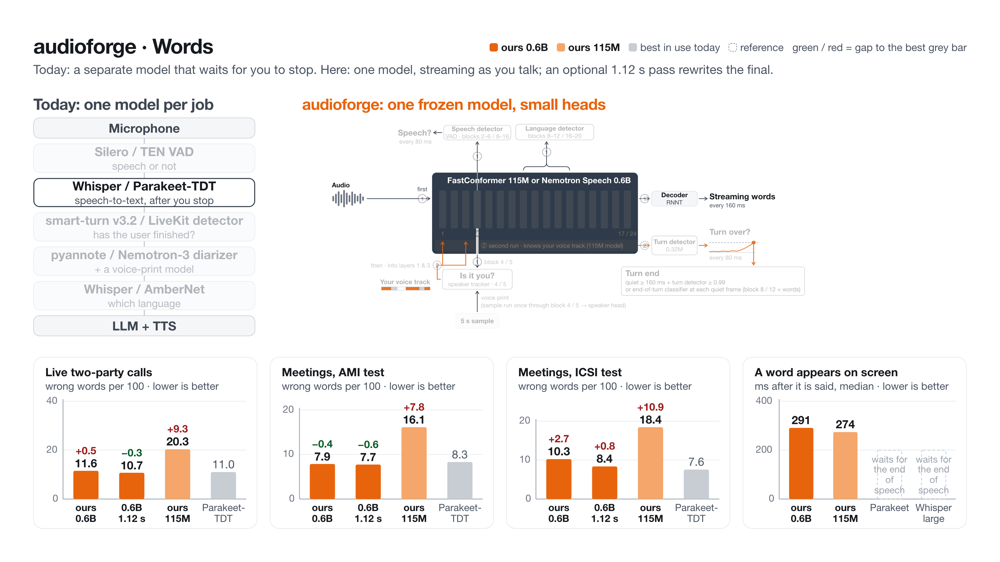
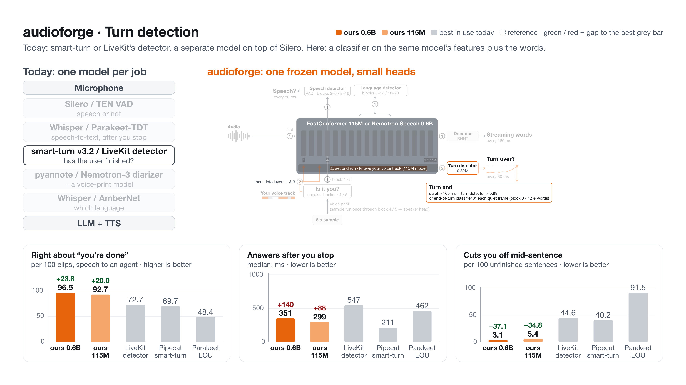
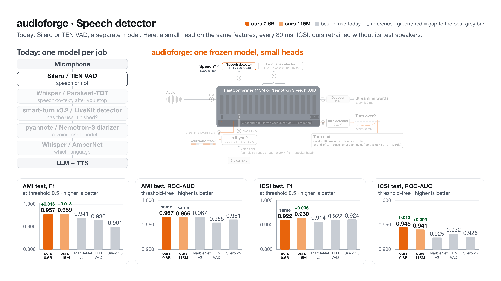
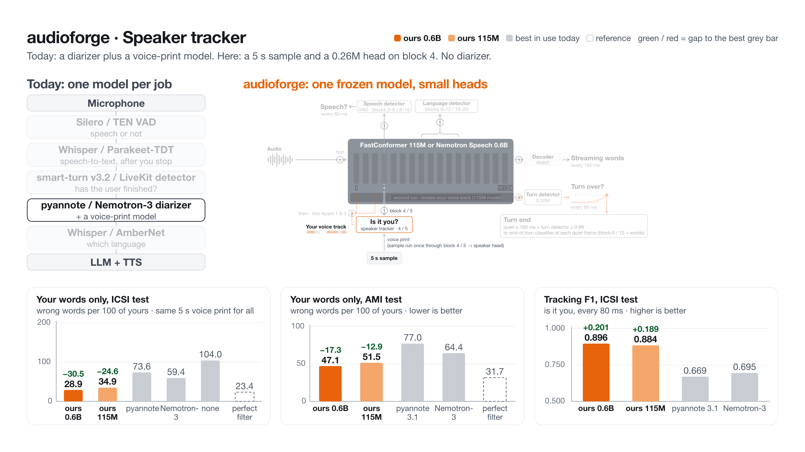
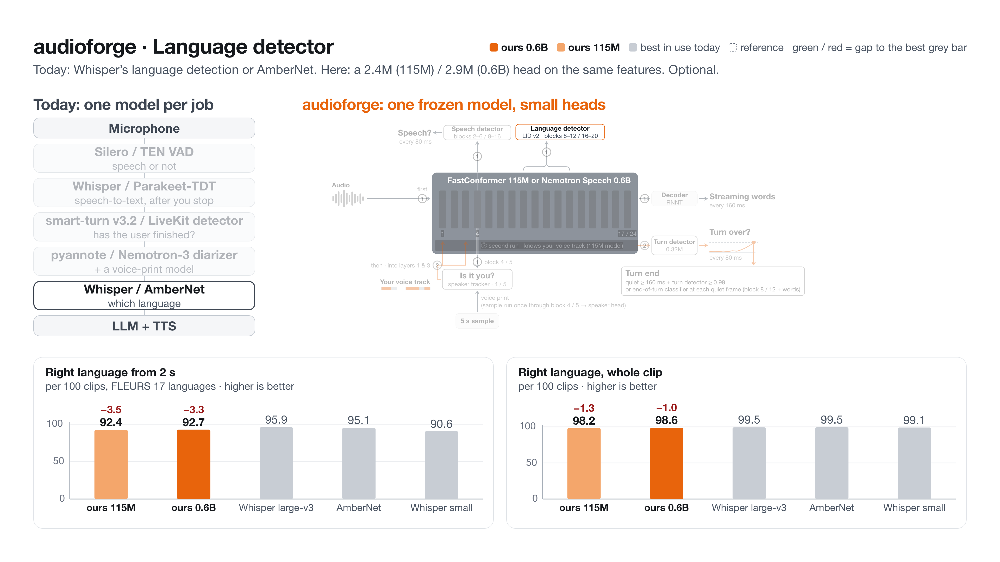

# audioforge

One frozen NVIDIA streaming speech model with six small heads: live words, voice activity, "is it the user?" and
"is the turn over?" for a voice agent that talks to one known user, over one WebSocket.



A 115M NVIDIA cache-aware FastConformer ([`stt_en_fastconformer_hybrid_large_streaming_multi`](docs/MODELS.md),
frozen, 160 ms chunks) gives the words (RNNT). The heads read its layers ([`docs/ARCHITECTURE.md`](docs/ARCHITECTURE.md)):

| head | reads | size | job |
|---|---|---|---|
| VAD | layer 4 | 33K | is anyone speaking? |
| speaker | layer 4 | 0.5M | a 192-number voice print |
| TS-VAD | layer 4 + the stored print | 0.26M | is it the user or someone else? |
| turn | a second, speaker-conditioned pass (GRU) | 0.32M | is the user's turn over? (`balanced`, `steady`) |
| turn classifier v5 | layer 8 of the first pass + VAD / TS-VAD + the words so far, at each quiet frame | 2.5M | is the user's turn over? (`fast`, `assistant`) |
| LID (optional) | layers 8-12 | 0.92M | which language? |

## What you get

- **Live transcripts** as the user talks (`partial`), and one `final` per turn.
- **Voice activity** every 80 ms from the model's own VAD head. No Silero.
- **Target speaker:** each frame and turn says whether the user or someone else is talking, from the user's stored
  voice print. No diarizer is loaded.
- **Turn ends** (`turn_end`) from the `vad_head` rule: the VAD and turn heads together, or the v5 turn classifier
  (`--turn-preset fast` / `assistant`).
- **One model, plain PyTorch** (no NeMo), on CPU, Mac GPU (`--device mps`) or CUDA. Pipecat and LiveKit adapters.

## Quickstart

Python 3.10+. `audioforge-download` shows each weight's licence and asks before fetching.

```bash
git clone https://github.com/maxmelichov/audioforge && cd audioforge
pip install -e ".[serve]"
audioforge-download          # the 115M model + heads, sha256-checked, into ./models
audioforge-serve             # single mode, ws://127.0.0.1:8765  (--device mps|cuda for a GPU)
```

Turn presets: `--turn-preset balanced` (default) `| fast` (calls, turn head v5) `| steady | assistant` (speech to an agent).

In a second terminal, stream the bundled 16 s two-party call ([`examples/audio/two_party_call_16s.wav`](examples/audio),
otoSpeech, CC BY 4.0) with the user's stored print (`two_party_call_16s.voiceprint.json`):

```bash
python examples/quickstart_client.py        # or: ... my.wav --voiceprint me.json
```

Output on an Apple M5 laptop (CPU, 2 threads; intermediate partials omitted):

```
  0.00s  voiceprint source=explicit seconds=0.0
  8.16s  partial   so um what value guides your life
 11.36s  partial   so um what value guides your life what values do you live by
 11.78s  turn_end  policy=vad_head silence_ms=640
 11.78s  final     speaker=0 'so um what value guides your life what values do you live by'
 15.20s  partial   value guys my life
 15.30s  turn_end  policy=vad_head silence_ms=160
 15.30s  final     speaker=1 'value guys my life'
```

The user's question is one turn despite a half-second pause after "life"; the other party's answer comes out as
`speaker=1`. In Python, without a socket ([`examples/python_api.py`](examples/python_api.py)):

```python
import audioforge
fe = audioforge.load()                      # device="mps" / "cuda" also work
s = fe.session(sample_rate=16000)
s.enroll(voiceprint)                        # 192 numbers, or fe.voiceprint(>= 5 s of the user's clean speech)
events = s.feed(pcm) + s.end()              # the protocol's messages as dicts
```

## Results

Public **test** splits only (2026-10-02): both cores and the best open models in use today, every baseline re-run on
the same audio and labels. Full tables with 95 % confidence intervals, and which audio each head was trained and
selected on: [`research/FINAL_COMPARE.md`](research/FINAL_COMPARE.md). Ours = audioforge on the 115M core (heads v0.4)
and on the English 0.6B core (heads v0.3).

**Words** (WER %, Whisper normaliser; ours stream at 160 ms, a word shows up about 0.3 s after it is said; the others
transcribe after the speaker stops)

| system | LibriSpeech test-clean | LibriSpeech test-other | AMI test meetings | ICSI test meetings | live calls, user channel |
|---|---:|---:|---:|---:|---:|
| ours 0.6B | 2.7 | 5.7 | **7.9** | 10.3 | **5.7** |
| ours 115M | 2.4 | 6.8 | 16.1 | 18.4 | 15.4 |
| Parakeet-TDT 0.6B v3 | **1.8** | **3.4** | 8.3 | **7.6** | 7.7 |
| Whisper large-v3 | 2.0 | 3.6 | 10.7 | 13.2 | 8.5 |
| Whisper small (LiveKit default) | 3.7 | 7.5 | 11.9 | 15.0 | 10.1 |



**Turn taking** (`--turn-preset assistant`, smart-turn v3.2's 399 public test clips)

| system | right about "done" | answers after you stop, p50 | cuts off unfinished sentences |
|---|---:|---:|---:|
| ours 115M | 92.7 % | 299 ms | 5.4 % |
| ours 0.6B | **96.5 %** | 351 ms | **3.1 %** |
| LiveKit turn detector + Silero | 72.7 % | 547 ms | 44.6 % |
| Pipecat smart-turn v3.2 + Silero | 69.7 % | **211 ms** | 40.2 % |
| NVIDIA Parakeet-Realtime-EOU | 48.4 % | 462 ms | 91.5 % |

On AMI test meetings (200 turns, default `balanced` preset): ours 115M 1527 ms / 15.5 % interruptions / 36.0 % missed,
ours 0.6B 1497 ms / 10.0 % / 33.5 %, LiveKit 745 ms / 13.0 % / 72.0 %, Pipecat 752 ms / 39.5 % / 53.0 %. Two-party call
rows are in FINAL_COMPARE.md, outside the headline: no labelled public test split exists for them.



**Speech detection** (F1 at threshold 0.5, test meetings): AMI ours 0.959 (115M) / 0.957 (0.6B), MarbleNet v2 0.941,
TEN VAD 0.928, Silero v5 0.899 (pyannote 0.975, offline). ICSI ours 0.940 (0.6B) / 0.938 (115M), Silero 0.922, TEN VAD
0.920, MarbleNet 0.914.



**Your words only** (target-speaker WER %, same 5 s voice print for every system, test meetings): ICSI ours 0.6B 29.0,
ours 115M 34.9, Nemotron-3 diarizer 59.4, pyannote 3.1 69.0; AMI ours 47.1 / 51.5, Nemotron-3 64.4, pyannote 77.1.



**Language ID** (FLEURS 17 languages, test, 2 s of speech): Whisper large-v3 95.9 %, AmberNet 95.1 %, ours 0.6B
92.7 %, ours 115M 92.4 %, Whisper small 90.6 %.



**Cost on an Apple-silicon laptop** (whole engine, per 160 ms of audio): 115M 28.6 ms on the GPU, 30.4 ms on 2 CPU
threads, 5 real-time streams on the GPU, 1.2 GB; 0.6B 42.9 ms GPU / 97.1 ms CPU, 3 streams on the GPU, 4.9 GB.

## Where it loses

- **Turn answers are not the fastest.** Pipecat smart-turn answers assistant speech sooner (211 ms vs 299 / 351 ms
  p50) and meeting turns sooner, at many more cut-offs. The `assistant` preset misses many meeting turns, so
  conversations use `balanced`; no single preset wins every column.
- **Words:** Parakeet-TDT v3 (offline) beats the 0.6B on ICSI test meetings (7.6 vs 10.3 %) and on LibriSpeech
  (3.4 vs 5.7 % on test-other). The 115M core is behind every offline baseline on meetings; use `--core 0.6b` for
  transcript quality.
- **Language ID:** Whisper large-v3 and AmberNet beat our heads, most at 2 s (95.9 vs 92.7 %).
- **Speaker embeddings alone:** TitaNet-L and WeSpeaker match voices better than our speaker heads (EER AMI test
  1.9 % vs 3.8-5.0 %); our tracker still gives the best target-speaker WER.
- Not measured: paid APIs (Deepgram Nova-3, AssemblyAI).

## Modes and the voice sample

**Single mode** (`audioforge-serve`, the default) is the product: one model, no Silero, no diarizer. It needs the
user's voice print, taken from **at least 5 s of their clean speech, alone (10 s for meetings)**. Store it per user
and send it right after the session config:

```json
{"type": "enroll", "embedding": [0.0213, -0.0871, "... 192 numbers"]}
```

Make one with `audioforge.voiceprint(audio)`, or start the server with `--enroll explicit` and send `{"type":
"enroll"}` to take the next 5 s of speech. Without a stored print the server grabs one live after `agent_end`,
which tracks the user worse ([`research/SINGLE_MODEL.md`](research/SINGLE_MODEL.md)).

**Room mode** (`audioforge-download --diarizer nemotron3`, then `audioforge-serve --mode room`) is opt-in: NVIDIA
Nemotron-3-Diarization labels everyone in the room, and `--final-asr tdt_v3` rewrites each turn with Parakeet-TDT v3.

## A bigger core: `--core 0.6b`

```bash
audioforge-download --core 0.6b          # NVIDIA nemotron-speech-streaming-en-0.6b + its heads (2.5 GB download)
audioforge-serve --core 0.6b --device mps
```

The same server and protocol on NVIDIA's 618M streaming model
([`nemotron-speech-streaming-en-0.6b`](https://huggingface.co/nvidia/nemotron-speech-streaming-en-0.6b), NVIDIA Open
Model License). Every head is retrained on it (VAD, speaker, TS-VAD, both turn heads, LID). The 115M stays the default.
Voice prints belong to one core, so re-enroll after switching. Numbers on the same benchmarks
([`research/CORE_0P6B.md`](research/CORE_0P6B.md)):

| | 115M (default) | 0.6B |
|---|---:|---:|
| WER, AMI / ICSI meetings | 24.4 / 27.3 % | **11.2 / 14.4 %** |
| WER, live two-party calls (all words / user channel) | 22.5 / 17.1 % | **13.7 / 7.7 %** |
| target-speaker WER, AMI / ICSI | 62.1 / 37.1 % | 63.2 / **31.7 %** |
| speaker EER within a meeting, AMI / ICSI | 19.8 / 7.0 % | **13.6 / 3.6 %** |
| VAD F1, AMI / ICSI | 0.951 / 0.898 | 0.951 / **0.906** |
| turn end, calls (`balanced`): p50, false interruptions, missed | 956 ms, 20.2 %, **7.3 %** | **725 ms, 19.3 %**, 10.1 % |
| turn end, calls (`fast`): p50, false interruptions, missed | 547 ms, **24.8 %, 5.5 %** | **487 ms**, 26.6 %, 11.0 % |
| turn end, AMI (`balanced`): p50, false interruptions, missed | 1326 ms, **10.5 %**, 33.5 % | **1177 ms**, 11.0 %, **33.0 %** |
| speech to an agent (`assistant`): accuracy, p50, false fires | 92.2 %, **292 ms**, 5.4 % | **96.5 %**, 351 ms, **3.1 %** |
| compute per 160 ms chunk, CPU 2 threads / Apple GPU | **30 / 29 ms** | 96 / 39 ms |
| real-time streams, CPU 2 threads / Apple GPU | **4 / 5** | 1 / 3 |
| memory | **1.1 GB** | 5.0 GB (+3.3 GB GPU) |

What you gain: transcripts at about half the error, a better voice print, better ICSI tracking. What it costs: 3× the
CPU per chunk, a quarter of the streams, 4× the memory, and a less permissive licence. End of turn is mixed (heads
v0.2, constants re-picked on held-out data):
- faster on calls and meetings, and a more accurate agent preset;
- but it misses more call ends (10-11 vs 5.5-7.3 %) and answers an agent 80 ms later.

The cause is the 0.6B's VAD head on quiet phone channels ([`research/CORE_0P6B_TURN.md`](research/CORE_0P6B_TURN.md)).

## Integrations

- **Pipecat:** `pip install -e ".[pipecat]"`, `audioforge.integrations.pipecat` (VAD, STT and turn analyzer);
  demo [`examples/pipecat_local_demo.py`](examples/pipecat_local_demo.py).
- **LiveKit Agents:** `pip install -e ".[livekit]"`, `audioforge.integrations.livekit.AudioforgeFrontend`; worker
  [`examples/livekit_agent_worker.py`](examples/livekit_agent_worker.py).
- **Any language:** the WebSocket protocol ([`docs/PROTOCOL.md`](docs/PROTOCOL.md)); a torch-free Python client is in
  [`packages/audioforge-client`](packages/audioforge-client).

## Docs

| | |
|---|---|
| [`docs/ARCHITECTURE.md`](docs/ARCHITECTURE.md) | the model and the server on one page |
| [`docs/CONFIGURATION.md`](docs/CONFIGURATION.md) | every flag and what it costs |
| [`docs/PROTOCOL.md`](docs/PROTOCOL.md) | the WebSocket messages |
| [`docs/MODELS.md`](docs/MODELS.md) | the downloaded weights, pinned revisions, licences |
| [`docs/SERVER_INTERNALS.md`](docs/SERVER_INTERNALS.md) | frame clock, policies, enrollment |
| [`research/METRICS.md`](research/METRICS.md) | metric definitions and the full scorecard |
| [`research/README.md`](research/README.md) | index of every lab note, with its key number |
| [`CHANGELOG.md`](CHANGELOG.md) | what changed |

## Licence

- Code and the trained heads: Apache-2.0 ([`LICENSE`](LICENSE)).
- The NVIDIA encoder: CC-BY-4.0; `audioforge-download` fetches it from NVIDIA and the merged model keeps that licence
  (attribution to NVIDIA).
- The LID head was trained on NVIDIA AmberNet outputs (NGC Terms of Use). Treat it as under those terms until its
  redistribution is confirmed; it is optional.
- Silero VAD is no longer needed in single mode. Room-mode weights keep their own licences. Full list:
  [`NOTICE`](NOTICE), [`docs/MODELS.md`](docs/MODELS.md).
